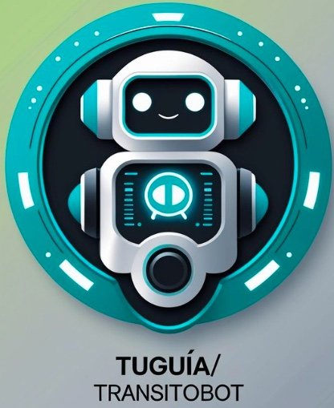
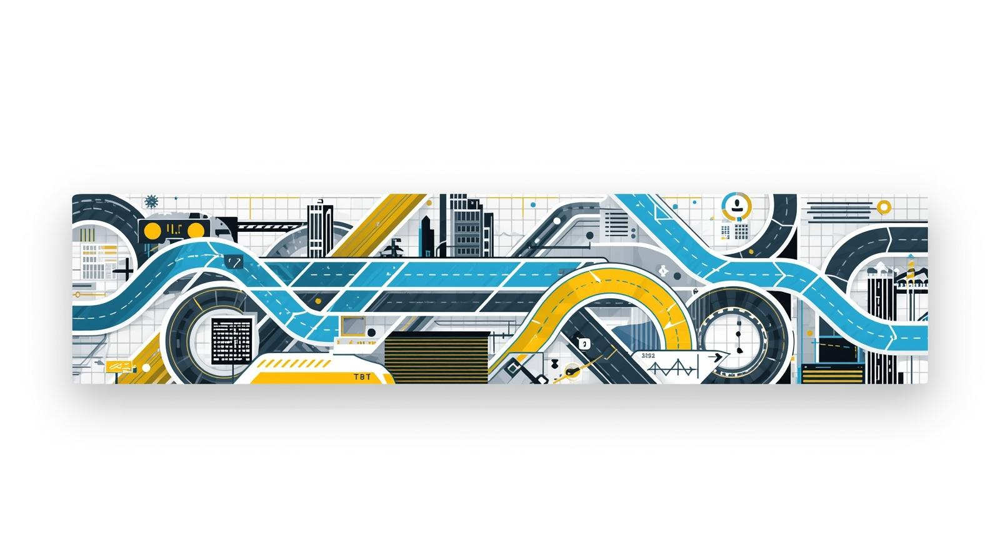

<div align="center">



<br/>

<h1>🤖 TuGuía_Vial / TransitoBot</h1>
<h3>Asistente Inteligente de Normativa Vial para Soacha, Cundinamarca</h3>

<br/>

[](./01_Investigacion_Academica)
[](./03_Sistema_TransitoBot)
[](./03_Sistema_TransitoBot/backRag)
[](./04_Despliegue_Arquitectura)

<br/>
<br/>

> Resumen Ejecutivo: Prototipo funcional de inclusión tecnológica diseñado para educar y empoderar al ciudadano de Soacha. Implementa una arquitectura de IA Híbrida capaz de interpretar la complejidad legal y entregarla en lenguaje natural, respondiendo al desconocimiento normativo mediante una solución escalable y de alto impacto social.

</div>

---

## 🧭 Arquitectura del trabajo de grado

Acceso rápido a los componentes del producto de investigación:

<div align="center">
<table>
<tr>
<td align="center" width="25%">
<a href="./01_Investigacion_Academica">
<br>
<br>
<b>01. Investigación</b>
</a><br>
<sub>Fundamentación & Tesis</sub>
</td>
<td align="center" width="25%">
<a href="./02_Base_Conocimiento_Legal">
<br>
<br>
<b>02. Base Legal</b>
</a><br>
<sub>Corpus Normativo (RAG)</sub>
</td>
<td align="center" width="25%">
<a href="./03_Sistema_TransitoBot">
<br>
<br>
<b>03. Código Fuente</b>
</a><br>
<sub>React • FastAPI • Rasa</sub>
</td>
<td align="center" width="25%">
<a href="./04_Despliegue_Arquitectura">
<br>
<br>
<b>04. Infraestructura</b>
</a><br>
<sub>Docker • Orquestación</sub>
</td>
</tr>
</table>
</div>

---

## 🏙️ Problemática: El Caso Soacha

En 2023, Soacha impuso **9,640 órdenes de comparendo**, evidenciando una brecha crítica entre la complejidad de la ley y el conocimiento del ciudadano.

> 🚨 **Insight Crítico:** El incremento del **75%** en un solo año no refleja solo imprudencia, sino una **falla estructural** en el acceso a la información normativa.

| Indicador | Dato 2023 | Interpretación Técnica |
| :--- | :---: | :--- |
| **Tendencia** | 📈 **+75%** | Crecimiento exponencial respecto al año anterior (2022). |
| **Infracción Top (C14)** | 🚗 **4,901** | *Transitar por sitios restringidos.* Evidencia falta de conocimiento espacial/temporal. |
| **Población Afectada** | 👥 **~700k** | Habitantes impactados por congestión derivada de la incultura vial. |

*Fuente: Federación Colombiana de Municipios (FCM) - SIMIT.*

---

## 🏛️ Alineación Estratégica

El proyecto se articula con el **Plan de Desarrollo "El desarrollo es el plan" (2024-2027)**:

* ✅ **Ciudad Inteligente:** Modernización de servicios mediante IA ([Ref. pág. 371]).
* ✅ **Meta SPOT-14:** Innovación tecnológica y banco de emprendimiento.
* ✅ **Educación:** Herramienta de capacitación técnica masiva para la comunidad.

---

## 🧠 Arquitectura Híbrida del Sistema

El sistema implementa un patrón de **Microservicios Orquestados**, integrando un motor determinista (NLU) con uno generativo (LLM).

```mermaid
graph TD;
    classDef front fill:#0c2546,stroke:#38bdf8,stroke-width:2px,color:white;
    classDef logic fill:#0f3928,stroke:#4ade80,stroke-width:2px,color:white;
    classDef ai fill:#381808,stroke:#fb923c,stroke-width:2px,color:white;
    classDef db fill:#2e1065,stroke:#a78bfa,stroke-width:2px,color:white;
    classDef user fill:#1f2937,stroke:#ffffff,stroke-width:2px,color:white;

    User((👤 Ciudadano)):::user -->|HTTPS| Front[💻 Frontend React+Vite]:::front;
    Front -->|REST API| Router[🚦 RouterBack FastAPI]:::logic;
    
    subgraph "Core de Decisión"
        Router -->|1. Clasificación| Rasa[🤖 RASA NLU]:::logic;
        Rasa -- "Confianza > 0.8" --> Router;
        Rasa -- "Confianza Baja (Fallback)" --> Router;
    end
    
    Router -->|2. Consulta Compleja| BackRag[🧠 BackRag Service]:::ai;
    
    subgraph "Retrieval Augmented Generation"
        BackRag -->|Query Vectorial| Chroma[(🗄️ ChromaDB)]:::db;
        Chroma -- "Contexto (Ley 769)" --> BackRag;
        BackRag -->|Prompt + Contexto| Claude{{☁️ Claude AI API}}:::ai;
        Claude -->|Respuesta Natural| BackRag;
    end
    
    BackRag --> Router;
    Router --> Front;
    
    linkStyle default stroke:#9ca3af,stroke-width:1px;
